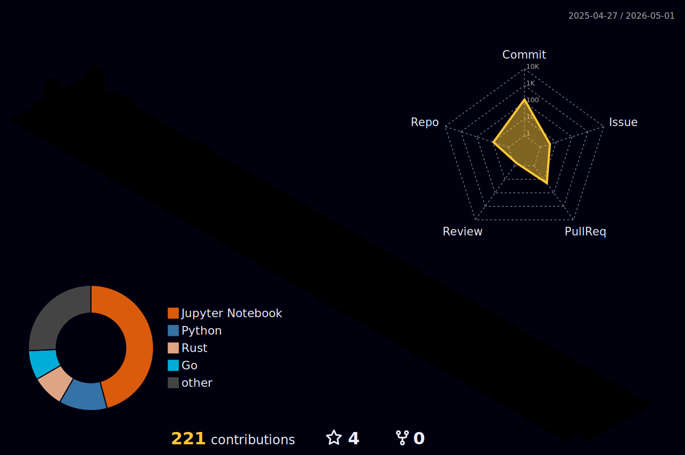

Olá Pessoal! Sou o Nicolas Thomazini👋

- 🔍 Apaixonado por Machine Learning, Data Science, LLM e derivados de Inteligência Artificial.
- 🎯 Buscando oportunidades para aplicar inteligência de dados em soluções de impacto.
- 📈 Crio projetos com foco em aprendizado contínuo, escalabilidade e eficiência.

|  |  |
| --------------------------------------------------------------------------------------------------------------------------------------------------------------------------------------------------------------- | -------------------------------------------------------------------------------------------------------------------------------------------------------------------------------------------------- |

   

     
  

## 📫 Contatos

  
  
  

 

  
  
  

## 🛠️ Plataformas e Tecnologias

## 📌 Hard Skills

🐍 Linguagens de Programação: Python (pandas, numpy, scikit-learn), SQL

📊 Visualização de Dados: Power BI, matplotlib, seaborn

🔍 Modelagem Preditiva: Regressão, classificação, métricas de desempenho

⚙️ Engenharia de Dados: Apache Spark, Airflow, ETL, Data Lakes

🧹 Manipulação de Dados: Limpeza, transformação e análise de dados estruturados

🔧 Conceitos de Computação: Algoritmos, estruturas de dados, lógica

🌐 Integração com APIs: FastAPI, consumo de APIs REST (OpenAI, Mistral etc.)

🔄 Versionamento: Git e GitHub

🗣️ Apresentação de Resultados: Data storytelling, construção de relatórios, dashboards

## 🚀 Projetos em Destaque

 

> LLM Zoomcamp – Pipelines com LLMs, LangChain, RAG e integração de APIs

> ML Zoomcamp – Modelagem preditiva com validação e testes

> Sparking_Flow – Orquestração de pipelines com Apache Spark e Airflow

> Human Disease Models – Previsão de doenças com ML e Deep Learning

> DAS BI Data Science – Dashboards dinâmicos com Power BI + SQL
