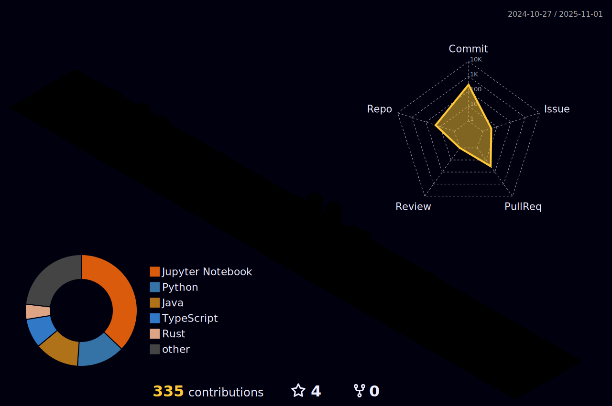

# Hello Everyone! I'm Nicolas Thomazini 👋

- 🔍 Passionate about Machine Learning, Data Science, LLMs, and AI-related technologies.

- 🎯 Seeking opportunities to apply data intelligence in impactful solutions.

- 📈 I build projects focused on continuous learning, scalability, and efficiency.

---

## 📊 GitStats

---

---

---

---

## 📫 Contacts

---

## ⏱️ Coding Time & Programming Languages

---

## 🛠️ Platforms and Technologies

---

## 📌 Hard Skills

- 🐍 Programming Languages: Python (pandas, numpy, scikit-learn), Rust, Go, SQL

- 🧠 Machine Learning & LLMs: Model training, fine-tuning, RAG pipelines, embeddings, vector databases

- 📊 Data Visualization: Power BI, matplotlib, seaborn

- 🔍 Predictive Modeling: Regression, classification, performance metrics

- ⚙️ Data Engineering: Apache Spark, Airflow, ETL, Data Lakes, MLflow, Kubernetes, Docker, model packaging, deployment on AWS (via Elastic Beanstalk) and GCP

- 🧹 Data Handling: Cleaning, transforming, and analyzing structured data

- 🔧 Computer Science Concepts: Algorithms, data structures, logic

- 🌐 API Integration: FastAPI, REST API consumption (OpenAI, Mistral, etc.)

- 🔄 Version Control: Git and GitHub

- 🗣️ Results Presentation: Data storytelling, reports, dashboards

---

## 🚀 Featured Projects

---

> `ml_solana_predict` – API using MLFlow for predictive modeling with validation and tests to forecast asset values.

> `Human Disease Models` – Disease prediction using ML and Deep Learning.

> `rs-ai-diagnosis` – AI assistant that suggests possible diseases based on symptoms (LLM-based).

> `docling_document_parser` – PDF parser using AI and OCR to extract text, tables, and images from digital or scanned documents.

> `Sparking_Flow` – Pipeline orchestration using Apache Spark and Airflow.
